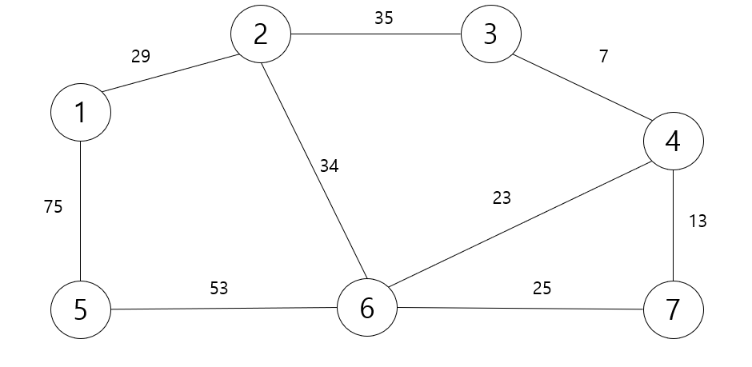
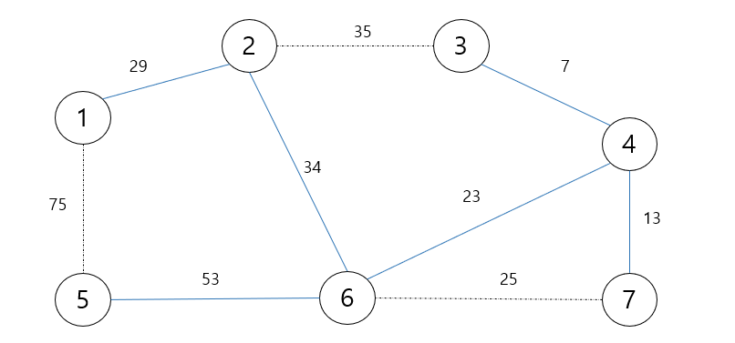

# 크루스칼 알고리즘







## 입력예시

```java
7 9
1 2 29
1 5 75
2 3 35
2 6 34
3 4 7
4 6 23
4 7 13
5 6 53
6 7 25
```

## 출력 예시

```java
153
```

```java

class Edge implements Comparable<Edge> {

    int distance;
    int a;
    int b;

    public Edge(int distance, int a, int b) {
        this.distance = distance;
        this.a = a;
        this.b = b;
    }

    // 거리(비용)가 짧은 것이 높은 우선 순우를 가지도록 설정
    @Override
    public int compareTo(Edge o) {
        if (this.distance < o.distance) {
            return -1;
        }
        return 1;
    }
}


public class 크루스칼알고리즘 {
    // 노드의 개수(v)와 간선(Union 연산) 의 개수 (E)
    // 노드의 개수는 최대 100,000개라고 가정
    public static int v, e;
    public static int[] parent = new int[100_001]; // 부모 테이블 초기화하기
    public static ArrayList<Edge> edges = new ArrayList<>();
    public static int result = 0;

    // 특정 원소가 속한 집합을 찾기
    public static int findParent(int x) {
        // 루트 노드가 아니라면, 루트 노드를 찾을 때 까지 재귀적으로 호출
        if (x == parent[x]) return x;
        return parent[x] = findParent(parent[x]);
    }

    // 두 원소가 속한 집합을 합치기
    public static void unionParent(int a, int b) {
        a = findParent(a);
        b = findParent(b);
        if (a < b) parent[b] = a;
        else parent[a] = b;
    }

    public static void main(String[] args) {
        Scanner sc = new Scanner(System.in);
        v = sc.nextInt();
        e = sc.nextInt();

        for (int i = 1; i <= v; i++) {
            parent[i] = i;
        }
        for (int i = 0; i < e; i++) {
            int a = sc.nextInt();
            int b = sc.nextInt();
            int cost = sc.nextInt();
            edges.add(new Edge(cost, a, b));
        }
        // 간선을 비용 순으로 정렬
        Collections.sort(edges);
        for (Edge edge :edges){
            int cost = edge.distance;
            int a = edge.a;
            int b = edge.b;
            // 사이클이 발생하지 않는 경우에만 집합에 포함
            if (findParent(a) != findParent(b)) {
                unionParent(a,b);
                result +=cost;
            }
        }
        System.out.println(result);

    }
}

```